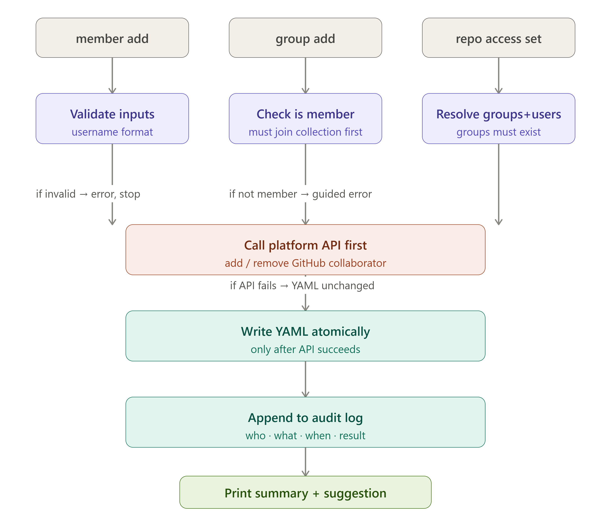
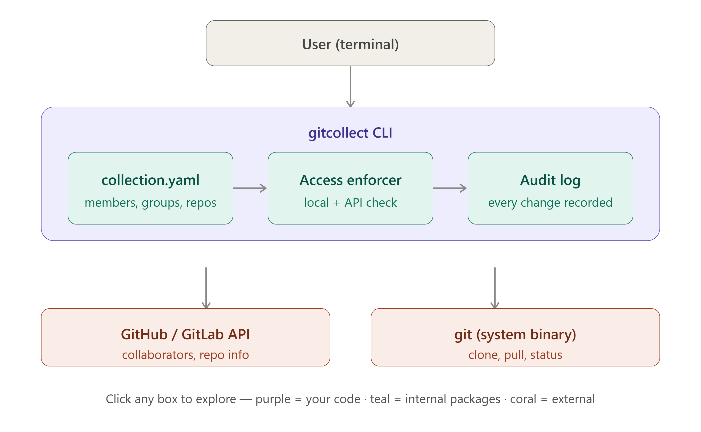

# gitcollect


Group your GitHub and GitLab repositories into named collections — with
per-repo access control neither platform gives you natively.

**[Full command reference & docs](https://alby-tomy.github.io/gitcollect/)**
— every command and flag, plus a worked two-person walkthrough of sharing a
collection end to end.

## The problem

GitHub and GitLab give you a flat list of repos under an org or a user, and
that's it. There's no native concept of "these eleven repos, across two
orgs and my personal account, are one logical project" — let alone a way to
say "this subset of my team can see these three, and that subset can see
the other eight." Today that means either over-sharing (everyone on the
team gets collaborator access to everything) or a spreadsheet someone
maintains by hand and nobody trusts. GitHub's own team has said custom
repo grouping isn't something they're building — which is reasonable, it's
not really their problem to solve at the platform level. It's gitcollect's.

## Quick demo

```
$ gitcollect init cybersecurity
✓ Created collection "cybersecurity" (private) on github.com
Run: gitcollect add cybersecurity <repo>

$ gitcollect add cybersecurity pen-test-tools
✓ Added pen-test-tools to "cybersecurity" (open to all 0 members)
Run: gitcollect repo access cybersecurity pen-test-tools --groups <g1,g2>

$ gitcollect member add cybersecurity teammate-username
✓ Added teammate-username to cybersecurity

  Granted access: pen-test-tools

$ gitcollect clone cybersecurity
✓ Access verified (teammate-username · no groups)
  1 of 1 repos accessible
[1/1] Cloning pen-test-tools...               ✓ done  (1.2s)
✓ Cloned 1 repo(s) in 1.2s
```

That's the whole loop: declare a collection, add repos to it, add a
teammate, and the moment they run `clone`, gitcollect has already made them
a real collaborator on exactly the repos they're entitled to — nothing
more.

## How is this different from ghorg / gh repo list / etc?

**[ghorg](https://github.com/gabrie30/ghorg)** and tools like
[myrepos](https://myrepos.branchable.com/) already solve cloning an entire
existing GitHub org or GitLab group efficiently — point them at an org and
they clone everything in it, fast, with mature config and caching. If
that's your need — "give me every repo in this org" — use one of them,
they're well-tested for exactly that job. `gh repo list` / `glab repo
list` cover the read-only "what's in this org" case well too, straight
from the platform's own CLI.

gitcollect solves a different problem: organizing repos that don't already
live under one platform-level org or group — a mix of personal repos and
repos across two or three different orgs, say — and then controlling who
on your team can reach which of them, as one logical unit. Neither GitHub
nor GitLab nor any of the tools above does that; there's no platform
concept of "a group of repos that span multiple real orgs," so there's
nothing for a bulk-clone tool to point at. gitcollect's `collection` is
that concept, kept as a local YAML file you own.

```
Use ghorg / myrepos when:  you want everything already in one org/group, as-is
Use gitcollect when:       you want your own custom groupings across personal
                           repos or multiple orgs, with per-repo access control
```

If your repos already live under one org and platform-native access is
enough, gitcollect adds nothing you don't already have — use the simpler
tool.

## Installation

Prebuilt binaries for linux/macos/windows (amd64/arm64) are produced by
[goreleaser](https://goreleaser.com) per [.goreleaser.yaml](.goreleaser.yaml)
when a release is cut (`make release`); check this repo's
[Releases](../../releases) page for whether one has been published yet.
Until then, build from source — it's one command and requires nothing but
Go itself:

```bash
git clone https://github.com/alby-tomy/gitcollect.git
cd gitcollect
go build -ldflags="-s -w -X main.version=dev" -o bin/gitcollect .
./bin/gitcollect --help
```

Or install straight onto your `$GOBIN`/`%GOBIN%`:

```bash
go install github.com/alby-tomy/gitcollect@latest
```

Requires Go 1.26+ (see [go.mod](go.mod)) and `git` on your `PATH` for
`clone`/`pull`/`status`/`sync`. No Homebrew tap exists yet — `go install`
or building from source are the supported paths today.

> **Windows note:** gitcollect's state path resolves via Go's
> `os.UserHomeDir()`, which reads `%USERPROFILE%`, not `$HOME` — if you're
> in Git Bash, `export HOME=...` won't affect the compiled binary.

## Quickstart

```bash
gitcollect auth                        # store a token, hidden prompt, verified live
gitcollect init cybersecurity          # you become the owner
gitcollect add cybersecurity pen-test-tools vuln-scanner   # repos accept multiple names
gitcollect member add cybersecurity teammate-username      # so do member add and group add
gitcollect show cybersecurity          # see exactly who can reach what
gitcollect clone cybersecurity         # clone everything you're entitled to
```

```
$ gitcollect show cybersecurity
Collection:  cybersecurity
Host:        github.com
Owner:       your-username
Visibility:  private
Members:     1
Groups:      0
Repos:       2

MEMBER
teammate-username

REPO            ACCESS RULE          YOU
pen-test-tools  open to all members  ✓ yes
vuln-scanner    open to all members  ✓ yes
```

`add`, `member add`, and `group add` all accept more than one value in a
single command — `gitcollect member add cybersecurity alice bob charlie`
adds all three, continuing past any one failure and reporting every
failure together at the end rather than aborting the whole batch.

The `YOU` column in `show` is the same access decision `clone` uses to pick
what it fetches — they can never disagree. Run `gitcollect <command>
--help` for the live version of anything below.

## Full command reference

The same reference below, browsable, is at
[alby-tomy.github.io/gitcollect](https://alby-tomy.github.io/gitcollect/).

<details open>
<summary><strong>Authentication</strong></summary>

| Command | Description |
|---|---|
| `gitcollect auth [--host github.com]` | Store a personal access token (hidden prompt), verified against the platform API before saving to `~/.gitcollect/config` at mode `0600`. `--host` defaults to `github.com`. |
| `gitcollect whoami [--json]` | Show the authenticated user for every host you've run `auth` on; a rejected token shows the error inline rather than hiding the rest. |

</details>

<details open>
<summary><strong>Collection lifecycle</strong></summary>

| Command | Description |
|---|---|
| `gitcollect init <name> [--host h] [--description d] [--public]` | Create a collection. Private by default — being the owner does not automatically make you a member. |
| `gitcollect delete <collection>` | Delete a collection and revoke every member's access to every repo first. Requires typing the collection's name to confirm. |
| `gitcollect list [--private\|--public] [--json]` | List collections you own or belong to, from local manifests only — no network calls. |
| `gitcollect show <collection> [--json]` | Summary: members, groups, repos, and a per-repo access column (`YOU` for a regular caller, `WHO HAS ACCESS` if you're the owner). Warns if the local file is >30 days stale. |
| `gitcollect visibility <collection> <public\|private>` | Change visibility. Switching to public asks for confirmation — it makes the collection's existence discoverable. |

</details>

<details open>
<summary><strong>Repo management</strong></summary>

| Command | Description |
|---|---|
| `gitcollect add <collection> <repo> [repo...]` | Add one or more repos, open to all members by default. Repo names are validated up front; per-repo failures (already added, sync error) don't abort the rest of the batch. |
| `gitcollect remove <collection> <repo>` | Remove a repo and revoke everyone's collaborator access to it first. Requires typing the repo's name to confirm. |
| `gitcollect repo access <collection> <repo> --groups g1,g2 \| --users u1,u2 \| --open` | Replace a repo's whole access rule. Groups and users are unioned — either satisfies access. |
| `gitcollect repo show <collection> <repo>` | A repo's current rule plus a per-member access table. |
| `gitcollect repo grant/revoke <collection> <repo> <user>` | Add or remove one user's individual grant without touching the rest of the rule. `grant` refuses on an open repo (would silently narrow access to just that user); `revoke` refuses if it would leave the repo with no restriction at all. |

</details>

```
$ gitcollect repo access cybersecurity vuln-scanner --groups red-team

✓ Updated access for vuln-scanner
  Before: open to all members
  After:  groups: red-team
Run: gitcollect inspect cybersecurity --repo vuln-scanner
```

<details>
<summary><strong>Member management</strong></summary>

| Command | Description |
|---|---|
| `gitcollect member add <collection> <username> [username...]` | Add one or more members, syncing each one's access across every repo they're now entitled to. On GitHub, warns if a grant leaves someone with a pending, unaccepted collaborator invite (GitLab has no such state). |
| `gitcollect member remove <collection> <username> [--confirm-self]` | Remove a member and revoke all their access. Removing yourself additionally requires `--confirm-self`. |
| `gitcollect member list <collection>` | Members and which groups each belongs to. |

</details>

<details>
<summary><strong>Group management</strong></summary>

| Command | Description |
|---|---|
| `gitcollect group create/delete <collection> <group>` | Create or delete a group. Delete is blocked, with the list of blockers, if any repo still restricts access to it. |
| `gitcollect group add <collection> <group> <username> [username...]` | Add one or more members to a group, syncing their repo access. Guides you to `member add` first for anyone who isn't a collection member yet. |
| `gitcollect group remove <collection> <group> <username>` | Remove a member from a group and re-sync their access. |
| `gitcollect group list/show <collection> [group]` | List every group, or show one group's members and the repos restricted to it. |

</details>

```
$ gitcollect group list cybersecurity
GROUP     MEMBERS  USERS
red-team  2        alice, bob
```

<details>
<summary><strong>Access inspection &amp; audit</strong></summary>

| Command | Description |
|---|---|
| `gitcollect inspect <collection> [--user u \| --repo r] [--json]` | No flags: the full member × repo matrix. `--user`: one person's full access map with the reason for each decision. `--repo`: who can reach one repo and why. Denied rows get a "To fix:" footer with the exact command to grant access. |
| `gitcollect audit <collection> [--user u] [--since 1h\|24h\|7d\|30d\|90d] [--json]` | The access change log — every mutation gitcollect ever attempted, including failures, newest first. `--since` only accepts those five exact values. |
| `gitcollect activity <collection> [--repo r] [--since ...] [--limit n] [--json]` | Code changes, not access changes: live commits per accessible repo's default branch, recorded to `~/.gitcollect/activity/<collection>.log`. |

</details>

```
$ gitcollect audit cybersecurity --since 7d

2026-01-20 14:32  alice       member.add            bob                   Added member
2026-01-19 09:10  alice       repo.access.set       vuln-scanner          open to all members → groups: red-team
2026-01-15 10:00  alice       init                  cybersecurity         Collection created (private)
```

<details>
<summary><strong>Git operations</strong></summary>

| Command | Description |
|---|---|
| `gitcollect clone <collection> [--pick "r1 r2"] [--dest d] [--concurrency n] [--dry-run]` | Clone every accessible repo (or just the ones in `--pick`). "Accessible" requires both the local rule and a live platform collaborator check. |
| `gitcollect pull <collection> [--dest d]` | `git pull` inside every accessible repo already cloned. |
| `gitcollect status <collection> [--dest d]` | `git status` inside every accessible repo already cloned, as a clean/changed table. |
| `gitcollect sync <collection> [--dest d] [--concurrency n] [--dry-run]` | Clone what's missing, pull what's already there — `clone` + `pull` in one pass, one access check. |

</details>

<details>
<summary><strong>System</strong></summary>

| Command | Description |
|---|---|
| `gitcollect version` | Print the build version and `GOOS/GOARCH`. |
| `gitcollect completion <bash\|zsh\|fish\|powershell>` | Shell autocompletion script, courtesy of Cobra. |

</details>

## How access control works

gitcollect never invents its own permission system. Every access decision
is enforced by the real GitHub/GitLab collaborator API — gitcollect's YAML
is a *declaration of intent* that drives the real platform, never a
parallel source of truth. A teammate can only actually clone a repo when
**two independent things are both true**: the local manifest says they
should have access, *and* the platform itself has already made them a real
collaborator on that specific repo. Hand-editing the YAML changes the
first; it can never fake the second.

A worked example — owner creates a collection, teammate clones it:

```
(you, the owner)                          (your teammate)
─────────────────                          ───────────────
gitcollect init cybersecurity
gitcollect add cybersecurity pen-test-tools
gitcollect member add cybersecurity \
  teammate-username
  → calls the platform API right away,
    adding teammate-username as a real
    collaborator on pen-test-tools

                                            gitcollect auth
                                            gitcollect show cybersecurity
                                              → YOU: ✓ yes
                                            gitcollect clone cybersecurity
                                              → succeeds: clone only ever
                                                fetches what show already
                                                said yes to
```

Per-repo access is a **union**, not an intersection, of groups and users —
satisfying either is enough:

```
repo "vuln-scanner":
  groups: [red-team]        ─┐
  users:  [eve]              ├─ OR  →  access granted to anyone in
                             ─┘        red-team, OR eve specifically

alice (in red-team)     → ✓ access (via group)
eve   (not in any group) → ✓ access (via individual grant)
bob   (in neither)        → ✗ no access — group red-team or
                                         individual grant required
```

An empty `groups: []` *and* empty `users: []` on a repo means "open to
every collection member" — that's the explicit empty-list convention, not
an oversight. `gitcollect repo grant`/`revoke` exist specifically so you
can add or remove one person's individual access without retyping the
whole `--users` list, with guardrails against the two ways that could
silently change the rule: granting one user to an otherwise-open repo
would narrow it to just them, and revoking someone's last individual grant
on an otherwise-unrestricted repo would silently reopen it to everyone.
Both are refused outright rather than allowed to happen by accident.

Every mutation follows the same shape — validate locally, call the
platform API, only then write the YAML, then append to the audit log:



## Security model

- **Token storage**: `~/.gitcollect/config` is created at file mode
  `0600`; the `~/.gitcollect/` directory itself is `0700`. Writes are
  atomic (temp file + rename), so a crash mid-write can't corrupt the
  token store or leave it world-readable even momentarily.
- **HTTPS-only**: `internal/api`'s GitHub and GitLab clients only ever
  build `https://` base URLs, and `internal/git`'s clone path explicitly
  rejects any clone URL that isn't `https://` before invoking `git`.
- **Input validation**: collection, repo, username, and group names are
  all checked against explicit allowlist regexes before anything touches
  disk or the network — e.g. repo names also reject `../`, `/`, `\`, and
  NUL bytes outright, not just a format mismatch.
- **Private collection non-disclosure**: a non-member hitting a private
  collection gets the exact same generic error
  (`collection not found or access denied`) whether the collection
  doesn't exist at all or simply isn't theirs to see — there's no way to
  fingerprint a private collection's existence by probing names.
- **Dual enforcement on every clone/pull**: access requires both the local
  manifest rule *and* a live `CheckCollaborator` call against the real
  platform API — passing only one is not enough.
- **Atomic YAML writes**: every collection manifest is written via
  temp-file-then-rename at `0600`, the same pattern as the token store.
- **No encryption of collection YAML**: membership lists are plaintext by
  design — a collection's member/group/repo structure isn't a secret the
  way a token is; only the token store gets restrictive permissions.

## Architecture

`cmd/` holds one file per command/command-group (21 non-test files, one
cobra `Command` each); `internal/` holds the actual logic, kept
deliberately separate from any CLI framework concern:

```
gitcollect/
├── main.go
├── cmd/               # 21 commands: auth, init, add, member, group, repo,
│                      # inspect, audit, activity, clone, pull, status,
│                      # sync, show, list, ...
└── internal/
    ├── collection/    # the YAML manifest itself — load/save/validate,
    │                  # IsMember/CanAccessRepo (pure, no network)
    ├── access/        # bridges collection + api: enforces, syncs
    │                  # platform state, builds inspect's matrices
    ├── api/           # GitHub + GitLab clients behind one interface
    ├── git/           # thin wrappers around the git subprocess
    ├── audit/         # access-change log (newline-delimited JSON)
    ├── activity/      # commit-activity log (separate from audit —
    │                  # code changes, not access changes)
    ├── config/        # ~/.gitcollect/ paths, token storage
    └── output/        # Success/Error/Table/JSON/Confirm helpers
```



`internal/collection` never calls a network API — it only reasons about
the local declaration of intent. `internal/access` is the only package
that bridges the two: it's where "does the YAML say yes" and "does the
platform actually agree" get checked together. See
[PROMPT.md](PROMPT.md) for the full design rationale, every architectural
decision made along the way, and the complete file-by-file build log.

## Roadmap

Not committed, just being considered for a future version:

- **Bitbucket support** — GitHub and GitLab only today; the `api.Client`
  interface was kept platform-agnostic on purpose so a third
  implementation wouldn't require touching `cmd/` or `internal/access`.
- **`gitcollect fetch`** — pulling a collection's YAML from somewhere
  other than a manual file copy/commit; today sharing a collection means
  literally sending the teammate the YAML file (see Installation/Security
  above — there's no server, so there's nothing to fetch from yet).
- **A dashboard or web UI** — a read-only view of `inspect`'s access
  matrix, for teams who'd rather glance at a page than run a CLI command.

Explicitly *not* planned, by design rather than by omission: a GUI/TUI, a
daemon or web server, a database (YAML + newline-delimited JSON audit log
is the whole storage layer), SSH clone support, or a `gitcollect admin`
mode that bypasses each user's own platform token.

## Contributing

Issues and pull requests welcome — open one [here](../../issues). Before
sending a PR: `go build ./...`, `go vet ./...`, and `go test ./... -cover`
should all be clean (`make test` runs the race-enabled, coverage-tracked
version). In the interest of being upfront about how this project is
built: gitcollect's implementation has been developed through an
AI-assisted process driven by a structured specification,
[PROMPT.md](PROMPT.md), which doubles as the project's design rationale
and session-by-session build log — worth reading before a non-trivial
change, since it records *why* a lot of non-obvious decisions were made,
not just what the code does.

## License

No `LICENSE` file currently exists in this repository, so no license
terms have actually been granted yet — the badge above reflects that
honestly rather than assuming one. If you're the maintainer, add a
`LICENSE` file before treating this as open source in any legal sense;
until then, all rights are reserved by default under copyright law.
