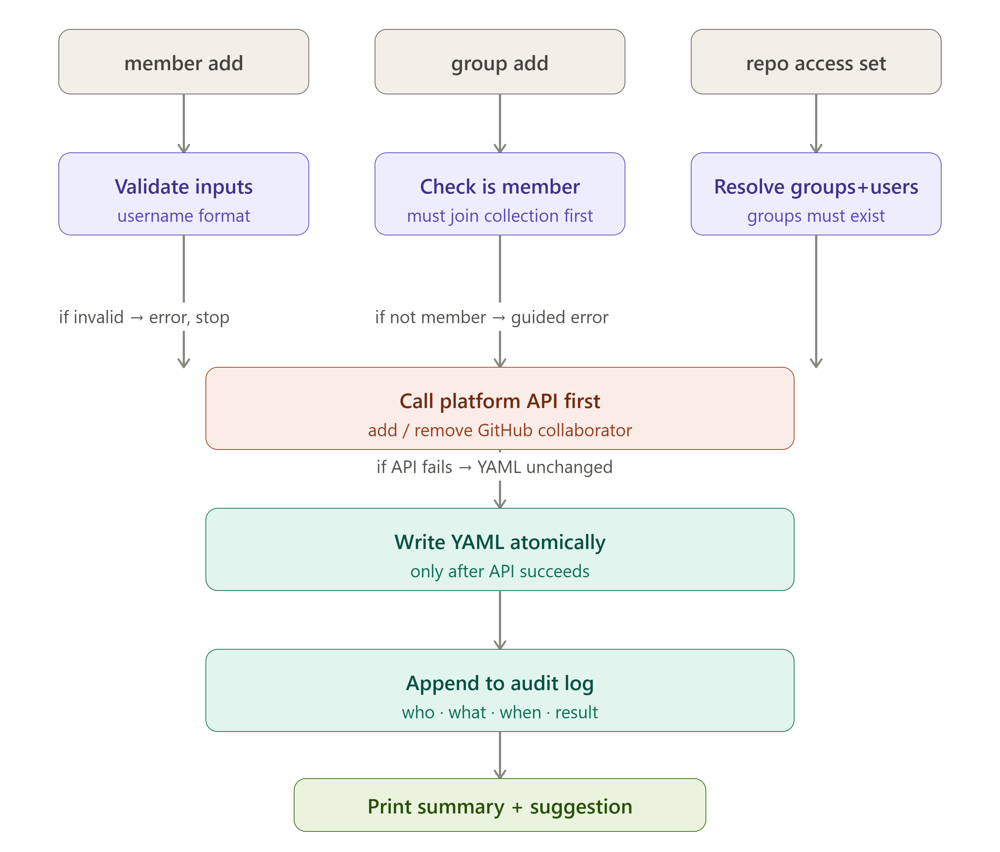
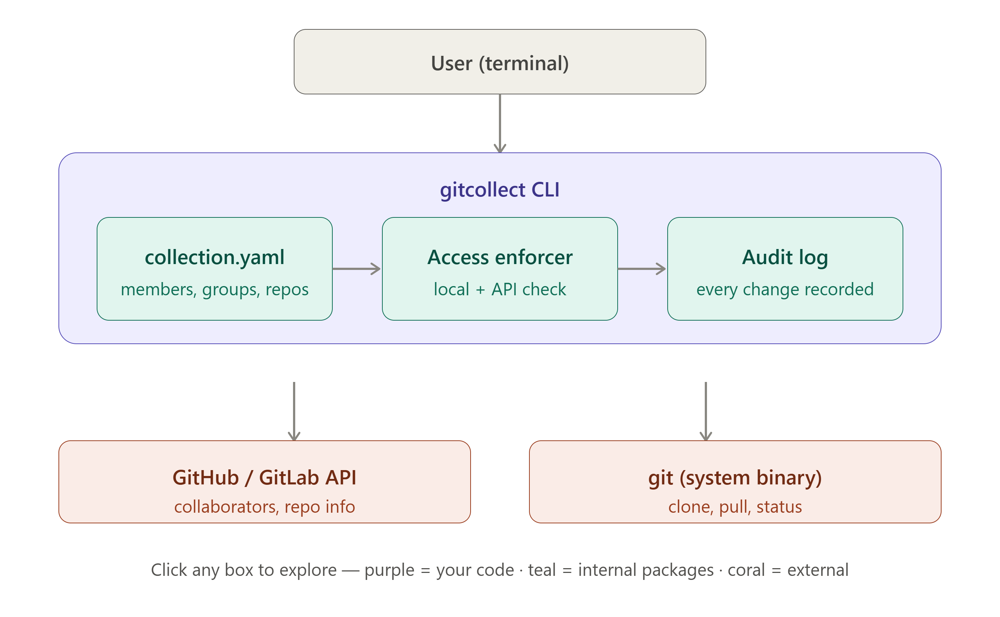

# gitcollect


Group your GitHub and GitLab repositories into named collections — with
per-repo access control neither platform gives you natively.

**[Full command reference & docs](https://alby-tomy.github.io/gitcollect/)**
— every command and flag, plus a worked two-person walkthrough of sharing a
collection end to end.

## The problem

GitHub and GitLab give you a flat list of repos under an org or a user, and
that's it. There's no native concept of "these eleven repos, across two
orgs and my personal account, are one logical project" — let alone a way to
say "this subset of my team can see these three, and that subset can see
the other eight." Today that means either over-sharing (everyone on the
team gets collaborator access to everything) or a spreadsheet someone
maintains by hand and nobody trusts. GitHub's own team has said custom
repo grouping isn't something they're building — which is reasonable, it's
not really their problem to solve at the platform level. It's gitcollect's.

And for orgs that already exist on GitHub or GitLab, setting up collections
by hand would take days: 30 teams × 100 repos × 300 members, all entered
one-by-one. The `import` command reads the existing structure from the
platform API and creates collections automatically in under two minutes.

## Quick demo

```
$ gitcollect init cybersecurity
✓ Created collection "cybersecurity" (private) on github.com
Run: gitcollect add cybersecurity <repo>

$ gitcollect add cybersecurity pen-test-tools vuln-scanner
✓ Added pen-test-tools to "cybersecurity" (open to all 0 members)
✓ Added vuln-scanner to "cybersecurity" (open to all 0 members)

$ gitcollect member add cybersecurity teammate-username
✓ Added teammate-username to cybersecurity
  Granted access: pen-test-tools, vuln-scanner

$ gitcollect clone cybersecurity
✓ Access verified (teammate-username · no groups)
  1 of 2 repos accessible
[1/2] Cloning pen-test-tools...               ✓ done  (1.2s)
[2/2] Cloning vuln-scanner...                 ✓ done  (0.8s)
✓ Cloned 2 repo(s) in 2.0s
```

For an existing org, skip the manual setup entirely:

```
$ gitcollect import --from github --org acme-corp

Pre-flight checks...
✓ Authenticated as alby-tomy (github.com)
✓ Token scopes: read:org, repo
✓ Organisation acme-corp found

Importing collections (30):
  [1/30]  payments-team      8 repos · 25 members · owner: payments-lead
  [2/30]  mobile-team       12 repos · 18 members · owner: mobile-lead
  ...

✓ Imported 30 collections
  312 unique members across all collections
```

## How is this different from ghorg / gh repo list / etc?

**[ghorg](https://github.com/gabrie30/ghorg)** and tools like
[myrepos](https://myrepos.branchable.com/) already solve cloning an entire
existing GitHub org or GitLab group efficiently — point them at an org and
they clone everything in it, fast, with mature config and caching. If
that's your need — "give me every repo in this org" — use one of them,
they're well-tested for exactly that job. `gh repo list` / `glab repo
list` cover the read-only "what's in this org" case well too, straight
from the platform's own CLI.

gitcollect solves a different problem: organizing repos that don't already
live under one platform-level org or group — a mix of personal repos and
repos across two or three different orgs, say — and then controlling who
on your team can reach which of them, as one logical unit. Neither GitHub
nor GitLab nor any of the tools above does that; there's no platform
concept of "a group of repos that span multiple real orgs," so there's
nothing for a bulk-clone tool to point at. gitcollect's `collection` is
that concept, kept as a local YAML file you own.

```
Use ghorg / myrepos when:  you want everything already in one org/group, as-is
Use gitcollect when:       you want your own custom groupings across personal
                           repos or multiple orgs, with per-repo access control
```

If your repos already live under one org and platform-native access is
enough, gitcollect adds nothing you don't already have — use the simpler
tool.

## Installation

### go install

If you have Go 1.26 or later installed, this is the fastest path:

```bash
go install github.com/alby-tomy/gitcollect@latest
```

The binary lands in `$GOBIN` (defaults to `$GOPATH/bin`, typically `~/go/bin`
on Linux/macOS and `%USERPROFILE%\go\bin` on Windows). Make sure that directory
is on your `PATH`.

Requires `git` on your `PATH` for the `clone`, `pull`, `status`, `sync`,
`publish`, and `pull-config` commands.

### Download binary

GoReleaser publishes pre-built, statically linked binaries for Linux, macOS,
and Windows (amd64 and arm64) on every release. Download the archive for your
platform from the [Releases](https://github.com/alby-tomy/gitcollect/releases)
page, verify the checksum, extract the binary, and place it on your `PATH`.

Archives follow the naming pattern
`gitcollect_<version>_<os>_<arch>[.tar.gz|.zip]` — for example
`gitcollect_1.2.3_linux_amd64.tar.gz`. Set `VERSION` to the release number
(no `v` prefix in the filename):

**Linux (amd64)**
```bash
VERSION=1.2.3
curl -L "https://github.com/alby-tomy/gitcollect/releases/download/v${VERSION}/gitcollect_${VERSION}_linux_amd64.tar.gz" | tar xz
sudo mv gitcollect /usr/local/bin/
```

**macOS (Apple Silicon / arm64)**
```bash
VERSION=1.2.3
curl -L "https://github.com/alby-tomy/gitcollect/releases/download/v${VERSION}/gitcollect_${VERSION}_darwin_arm64.tar.gz" | tar xz
sudo mv gitcollect /usr/local/bin/
```

**Windows (PowerShell, amd64)**
```powershell
$VERSION = "1.2.3"
Invoke-WebRequest "https://github.com/alby-tomy/gitcollect/releases/download/v$VERSION/gitcollect_${VERSION}_windows_amd64.zip" -OutFile gitcollect.zip
Expand-Archive gitcollect.zip -DestinationPath .
# Move gitcollect.exe to a directory on your PATH
```

Every release includes a `checksums.txt` with SHA-256 digests for all
archives. Verify with `sha256sum -c checksums.txt` (Linux/macOS) or
`Get-FileHash gitcollect.exe` (Windows) before running the binary.

> **Windows note:** gitcollect's state path resolves via Go's
> `os.UserHomeDir()`, which reads `%USERPROFILE%`, not `$HOME` — if you're in
> Git Bash, `export HOME=...` won't affect the compiled binary.

### Homebrew

```bash
brew install alby-tomy/tap/gitcollect
```

> **Coming soon.** The Homebrew tap is not published yet. Use `go install` or
> download a binary from the Releases page in the meantime.

### Verify the install

```
$ gitcollect version
gitcollect v1.0.0 linux/amd64
```

The OS and architecture come from the binary itself. If `version` prints
correctly, gitcollect is on your `PATH` and ready to use.

### Upgrading

**go install:** re-run `go install github.com/alby-tomy/gitcollect@latest` —
it replaces the previous binary in-place.

**Binary download:** download the new archive from the
[Releases](https://github.com/alby-tomy/gitcollect/releases) page and replace
the binary on your `PATH`.

**Homebrew:** `brew upgrade alby-tomy/tap/gitcollect` (once the tap is
published).

### Windows

> **Note:** Windows support is provided as a best-effort build. If you
> encounter any Windows-specific issues, please open an issue at
> https://github.com/alby-tomy/gitcollect/issues

Download `gitcollect_windows_amd64.zip` from the
[Releases](https://github.com/alby-tomy/gitcollect/releases) page.
Extract it to get `gitcollect.exe`.

To use it from any terminal, add it to a folder that's on your PATH:

1. Create `C:\Users\YourName\bin\` if it doesn't exist
2. Move `gitcollect.exe` there
3. Open Start → search "Environment Variables"
4. Click "Edit the system environment variables"
5. Under "System variables", find "Path" → Edit → New
6. Add: `C:\Users\YourName\bin`
7. Click OK, restart your terminal
8. Run: `gitcollect version`

### Upgrading from an earlier version

Collections created with gitcollect before July 2026 use an older format
that stores usernames instead of immutable platform user IDs. These files
are automatically upgraded the next time you run any command that modifies
the collection (`member add`, `group add`, `repo access`, etc.).

To force-upgrade a specific collection immediately:
```
gitcollect member list <collection>    # triggers upgrade if you are the owner
```

You do not need to do anything if the tool is working correctly — upgrades
happen transparently. This notice exists so you know what to expect if you
see a one-line "Migrated collection to v2" message in the output.

## Quickstart

```bash
gitcollect auth                                    # store a token, hidden prompt, verified live
gitcollect init cybersecurity                      # you become the owner
gitcollect add cybersecurity pen-test-tools vuln-scanner   # repos accept multiple names
gitcollect member add cybersecurity teammate       # so do member add and group add
gitcollect show cybersecurity                      # see exactly who can reach what
gitcollect clone cybersecurity                     # clone everything you're entitled to
```

```
$ gitcollect show cybersecurity
Collection:  cybersecurity
Host:        github.com
Owner:       your-username
Visibility:  private
Members:     1
Groups:      0
Repos:       2

MEMBER
teammate

REPO            ACCESS RULE          YOU
pen-test-tools  open to all members  ✓ yes
vuln-scanner    open to all members  ✓ yes
```

`add`, `member add`, and `group add` all accept more than one value in a
single command — `gitcollect member add cybersecurity alice bob charlie`
adds all three, continuing past any one failure and reporting every
failure together at the end rather than aborting the whole batch.

## Shell completion

gitcollect's `completion` subcommand supports bash, zsh, fish, and
PowerShell. No separate install step is needed.

```bash
source <(gitcollect completion bash)         # add to ~/.bashrc
source <(gitcollect completion zsh)          # add to ~/.zshrc
gitcollect completion fish > ~/.config/fish/completions/gitcollect.fish
gitcollect completion powershell | Out-String | Invoke-Expression  # add to $PROFILE
```

## Full command reference

<details open>
<summary><strong>Authentication</strong></summary>

| Command | Description |
|---|---|
| `gitcollect auth [--host github.com]` | Store a personal access token (hidden prompt), verified against the platform API before saving to `~/.gitcollect/config` at mode `0600`. `--host` defaults to `github.com`. |
| `gitcollect whoami [--json]` | Show the authenticated user for every host you've run `auth` on; a rejected token shows the error inline rather than hiding the rest. |

</details>

<details open>
<summary><strong>Collection lifecycle</strong></summary>

| Command | Description |
|---|---|
| `gitcollect init <name> [--host h] [--description d] [--namespace org] [--public]` | Create a collection. Private by default. `--namespace` sets the org whose repos this collection tracks (used by `import` and `sync-config`). |
| `gitcollect delete <collection>` | Delete a collection and revoke every member's access to every repo first. Requires typing the collection's name to confirm. |
| `gitcollect list [--private\|--public] [--json]` | List collections you own or belong to, from local manifests only — no network calls. |
| `gitcollect show <collection> [--json]` | Summary: members, groups, repos, and a per-repo access column (`YOU` for a regular caller, `WHO HAS ACCESS` if you're the owner). Warns if the local file is >30 days stale. |
| `gitcollect visibility <collection> <public\|private>` | Change visibility. Switching to public asks for confirmation. |
| `gitcollect transfer <collection> <new-owner>` | Transfer ownership to another member. Requires typing the new owner's username to confirm. Previous owner stays as a member. |
| `gitcollect scale <collection> <organisation\|team>` | Switch a collection between org tier (group admins enabled) and team tier. Org tier lets group admins manage their own groups without full collection ownership. |

</details>

<details open>
<summary><strong>Repo management</strong></summary>

| Command | Description |
|---|---|
| `gitcollect add <collection> <repo> [repo...]` | Add one or more repos, open to all members by default. Repo names are validated up front; per-repo failures don't abort the rest of the batch. Prompts to create the repo if it doesn't exist on the platform (on a TTY). |
| `gitcollect remove <collection> <repo>` | Remove a repo and revoke everyone's collaborator access to it first. Requires typing the repo's name to confirm. |
| `gitcollect repo access <collection> <repo> --groups g1,g2 \| --users u1,u2 \| --open` | Replace a repo's whole access rule. Groups and users are unioned — either satisfies access. |
| `gitcollect repo show <collection> <repo>` | A repo's current rule plus a per-member access table. |

</details>

```
$ gitcollect repo access cybersecurity vuln-scanner --groups red-team

✓ Updated access for vuln-scanner
  Before: open to all members
  After:  groups: red-team
Run: gitcollect inspect cybersecurity --repo vuln-scanner
```

<details>
<summary><strong>Member management</strong></summary>

| Command | Description |
|---|---|
| `gitcollect member add <collection> <username> [username...]` | Add one or more members, syncing each one's access across every repo they're entitled to. On GitHub, warns if a grant leaves someone with a pending, unaccepted collaborator invite (GitLab has no such state). |
| `gitcollect member remove <collection> <username> [--confirm-self]` | Remove a member and revoke all their access. Removing yourself additionally requires `--confirm-self`. |
| `gitcollect member list <collection>` | Members and which groups each belongs to. |

</details>

<details>
<summary><strong>Group management</strong></summary>

| Command | Description |
|---|---|
| `gitcollect group create/delete <collection> <group>` | Create or delete a group. Delete is blocked if any repo still restricts access to it. |
| `gitcollect group add <collection> <group> <username> [username...]` | Add one or more members to a group, syncing their repo access. |
| `gitcollect group remove <collection> <group> <username>` | Remove a member from a group and re-sync their access. |
| `gitcollect group list/show <collection> [group]` | List every group, or show one group's members and the repos restricted to it. |
| `gitcollect group admin add/remove/list <collection> <group> [username]` | Manage group admins (org tier only). Group admins can manage their own group's membership without full collection ownership. |

</details>

```
$ gitcollect group list cybersecurity
GROUP     MEMBERS  USERS
red-team  2        alice, bob
```

<details>
<summary><strong>Access inspection &amp; audit</strong></summary>

| Command | Description |
|---|---|
| `gitcollect inspect <collection> [--user u \| --repo r] [--json]` | No flags: the full member × repo matrix. `--user`: one person's full access map with the reason for each decision. `--repo`: who can reach one repo and why. Denied rows get a "To fix:" footer with the exact command to grant access. |
| `gitcollect audit <collection> [--user u] [--since 1h\|24h\|7d\|30d\|90d] [--json]` | The access change log — every mutation gitcollect ever attempted, including failures, newest first. `--since` only accepts those five exact values. |
| `gitcollect activity <collection> [--repo r] [--since ...] [--limit n] [--json]` | **[experimental]** Code changes, not access changes: live commits per accessible repo's default branch. |

</details>

```
$ gitcollect audit cybersecurity --since 7d

2026-01-20 14:32  alice  member.add   bob           Added member
2026-01-19 09:10  alice  repo.access  vuln-scanner  open → groups: red-team
2026-01-15 10:00  alice  init         cybersecurity Collection created (private)
```

<details>
<summary><strong>Git operations</strong></summary>

| Command | Description |
|---|---|
| `gitcollect clone <collection> [--pick "r1 r2"] [--dest d] [--concurrency n] [--dry-run]` | Clone every accessible repo (or just the ones in `--pick`). "Accessible" requires both the local rule and a live platform collaborator check. |
| `gitcollect pull <collection> [--dest d]` | `git pull` inside every accessible repo already cloned. |
| `gitcollect status <collection> [--dest d]` | `git status` inside every accessible repo already cloned, as a clean/changed table. |
| `gitcollect sync <collection> [--dest d] [--concurrency n] [--dry-run]` | Clone what's missing, pull what's already there — `clone` + `pull` in one pass, one access check. |

</details>

<details open>
<summary><strong>Organisation import</strong></summary>

| Command | Description |
|---|---|
| `gitcollect import --from github\|gitlab --org <org> [--team t] [--dry-run] [--flatten] [--owner-from-maintainer] [--namespace n] [--merge\|--overwrite\|--skip-existing]` | Read an org's team structure from GitHub or GitLab and create one collection per team. Concurrent fetching (max 4 parallel). Maintainers become collection owners by default. |
| `gitcollect publish --repo <org/repo> [--collection c] [--branch b] [--path p] [--message m]` | Push collection YAML files into a shared git repository so teammates can fetch them. |
| `gitcollect pull-config --repo <org/repo> [--collection c] [--branch b] [--path p] [--overwrite]` | Fetch collection files from a shared git repository into `~/.gitcollect/collections/`. |
| `gitcollect join --org <org> --team <team> [--repo r] [--clone] [--dest d] [--from github\|gitlab]` | New-hire onboarding in one command: fetch the team's collection and optionally clone all accessible repos. |
| `gitcollect sync-config [<collection>] [--all] [--from github\|gitlab] [--org o] [--dry-run]` | Re-fetch the current team state from the platform, show what changed, and update local collections. |

</details>

<details>
<summary><strong>System</strong></summary>

| Command | Description |
|---|---|
| `gitcollect version` | Print the build version and `GOOS/GOARCH`. |
| `gitcollect completion <bash\|zsh\|fish\|powershell>` | Shell autocompletion script, courtesy of Cobra. |

</details>

## Organisation import

For teams that already exist on GitHub or GitLab, the import commands remove
the manual setup burden entirely.

### The enterprise onboarding flow

**Admin setup (once):**

```bash
# 1. Import the whole org — creates one collection per team
gitcollect import --from github --org acme-corp

# 2. Publish collections to a shared repo for teammates to fetch
gitcollect publish --repo acme-corp/gitcollect-config
```

**New employee setup (once per person):**

```bash
# One command to configure and clone in a single step
gitcollect join --org acme-corp --team payments-team --clone
```

**Keeping collections in sync (ongoing):**

```bash
# After team membership or repo list changes on GitHub
gitcollect sync-config payments-team
```

### Single-team import

```
$ gitcollect import --from github --org acme-corp --team payments-team

✓ Imported payments-team
  8 repos · 25 members · owner: payments-lead
  Written to ~/.gitcollect/collections/acme-corp-payments-team.yaml
```

### Conflict handling

If a collection already exists locally and a new import brings different data:

```
⚠ Collection "payments-team" already exists locally.
  Local:  8 repos · 25 members
  Import: 9 repos · 26 members (platform current state)

  [o] Overwrite local with imported data
  [s] Skip this collection
  [m] Merge — add new repos/members, keep existing ones
  Choice [o/s/m]: m
```

Use `--merge`, `--overwrite`, or `--skip-existing` to set the default for
non-interactive runs (CI, scripts).

### Dry-run

```
$ gitcollect import --from github --org acme-corp --dry-run

[dry-run] Would create 30 collections:
  payments-team      8 repos · 25 members · owner: payments-lead
  mobile-team       12 repos · 18 members · owner: mobile-lead
  ...

[dry-run] No files written.
Run without --dry-run to apply.
```

### Sharing collections with teammates

The publish + pull-config pair replaces the old manual YAML copy workflow:

```bash
# Admin publishes once:
gitcollect publish --repo acme-corp/gitcollect-config

# Each teammate fetches once:
gitcollect pull-config --repo acme-corp/gitcollect-config
```

The shared repo (e.g. `acme-corp/gitcollect-config`) is a regular GitHub
repository — private is fine, team members only need read access.

> **Important:** receiving a collection file does not automatically grant
> platform collaborator access. The collection owner must run
> `gitcollect member add` to make access real — only then will
> `gitcollect clone` succeed for that member.

## How access control works

gitcollect never invents its own permission system. Every access decision
is enforced by the real GitHub/GitLab collaborator API — gitcollect's YAML
is a *declaration of intent* that drives the real platform, never a
parallel source of truth. A teammate can only actually clone a repo when
**two independent things are both true**: the local manifest says they
should have access, *and* the platform itself has already made them a real
collaborator on that specific repo. Hand-editing the YAML changes the
first; it can never fake the second.

A worked example — owner creates a collection, teammate clones it:

```
(you, the owner)                          (your teammate)
─────────────────                          ───────────────
gitcollect init cybersecurity
gitcollect add cybersecurity pen-test-tools
gitcollect member add cybersecurity \
  teammate-username
  → calls the platform API right away,
    adding teammate-username as a real
    collaborator on pen-test-tools

                                            gitcollect auth
                                            gitcollect show cybersecurity
                                              → YOU: ✓ yes
                                            gitcollect clone cybersecurity
                                              → succeeds: clone only ever
                                                fetches what show said yes to
```

Per-repo access is a **union**, not an intersection, of groups and users —
satisfying either is enough:

```
repo "vuln-scanner":
  groups: [red-team]        ─┐
  users:  [eve]              ├─ OR  →  access granted to anyone in
                             ─┘        red-team, OR eve specifically

alice (in red-team)      → ✓ access (via group)
eve   (not in any group) → ✓ access (via individual grant)
bob   (in neither)       → ✗ no access
```

An empty `groups: []` and empty `users: []` on a repo means "open to every
collection member" — the explicit empty-list convention, not an oversight.

Every mutation follows the same shape — validate locally, call the
platform API, only then write the YAML, then append to the audit log:



## Security model

- **Token storage**: `~/.gitcollect/config` is created at file mode
  `0600`; the `~/.gitcollect/` directory itself is `0700`. Writes are
  atomic (temp file + rename), so a crash mid-write can't corrupt the
  token store or leave it world-readable even momentarily.
- **HTTPS-only**: `internal/api`'s GitHub and GitLab clients only ever
  build `https://` base URLs, and `internal/git`'s clone path explicitly
  rejects any clone URL that isn't `https://` before invoking `git`.
- **Input validation**: collection, repo, username, and group names are
  all checked against explicit allowlist regexes before anything touches
  disk or the network.
- **Private collection non-disclosure**: a non-member hitting a private
  collection gets the exact same generic error whether the collection
  doesn't exist at all or simply isn't theirs to see — there's no way to
  fingerprint a private collection's existence by probing names.
- **Dual enforcement on every clone/pull**: access requires both the local
  manifest rule *and* a live `CheckCollaborator` call against the real
  platform API — passing only one is not enough.
- **Atomic YAML writes**: every collection manifest is written via
  temp-file-then-rename at `0600`, the same pattern as the token store.
- **Immutable IDs**: collections store platform user IDs (not mutable
  usernames) internally. A username rename can't break ownership checks.

## Architecture

`cmd/` holds one file per command or command-group (28 non-test files);
`internal/` holds the actual logic, kept deliberately separate from any
CLI framework concern:

```
gitcollect/
├── main.go
├── cmd/               # 28 files: auth, init, add, member, group, repo,
│                      # inspect, audit, activity, clone, pull, status,
│                      # sync, show, list, delete, visibility, whoami,
│                      # version, transfer, scale, import, publish,
│                      # pull_config, join, sync_config, ...
└── internal/
    ├── collection/    # the YAML manifest itself — load/save/validate,
    │                  # IsMember/CanAccessRepo (pure, no network)
    ├── access/        # bridges collection + api: enforces, syncs
    │                  # platform state, builds inspect's matrices
    ├── api/           # GitHub + GitLab clients behind one interface
    │                  # (ListOrgTeams, ListTeamMembers, GetTokenScopes,
    │                  # paginate helpers for multi-page API responses)
    ├── git/           # thin wrappers around the git subprocess
    ├── audit/         # access-change log (newline-delimited JSON)
    ├── activity/      # commit-activity log (separate from audit —
    │                  # code changes, not access changes)
    ├── config/        # ~/.gitcollect/ paths, token storage
    └── output/        # Success/Error/Table/JSON/Confirm helpers
```



`internal/collection` never calls a network API — it only reasons about
the local declaration of intent. `internal/access` is the only package
that bridges the two: it's where "does the YAML say yes" and "does the
platform actually agree" get checked together. See
[PROMPT.md](PROMPT.md) for the full design rationale, every architectural
decision made along the way, and the complete file-by-file build log.

## Roadmap

Not committed, just being considered for a future version:

- **Bitbucket support** — GitHub and GitLab only today; the `api.Client`
  interface was kept platform-agnostic on purpose so a third
  implementation wouldn't require touching `cmd/` or `internal/access`.
- **`gitcollect fetch`** — pulling a *single* collection's YAML from a
  URL (e.g. `gitcollect fetch github.com/you/cybersecurity`) rather than
  cloning a whole shared config repo. The publish/pull-config flow covers
  the team-wide case; per-collection URL fetch is still missing.
- **A dashboard or web UI** — a read-only view of `inspect`'s access
  matrix, for teams who'd rather glance at a page than run a CLI command.
- **Shared audit log** — a way for all collection members to see the
  same audit trail, not just the one stored locally on the owner's machine.
- **Stabilise `gitcollect activity`** — remove the experimental flag
  after real-world usage confirms the design (output format, flag names,
  cache behaviour).
- **Homebrew tap and Winget/Scoop packages** — binary installs without
  needing Go.

Explicitly *not* planned, by design rather than by omission: a GUI/TUI, a
daemon or web server, a database (YAML + newline-delimited JSON audit log
is the whole storage layer), SSH clone support, or a `gitcollect admin`
mode that bypasses each user's own platform token.

## Contributing

Issues and pull requests welcome — open one [here](https://github.com/alby-tomy/gitcollect/issues).
Before sending a PR: `go build ./...`, `go vet ./...`, and
`go test ./... -cover` should all be clean (`make test` runs the
race-enabled, coverage-tracked version). In the interest of being upfront
about how this project is built: gitcollect's implementation has been
developed through an AI-assisted process driven by a structured
specification, [PROMPT.md](PROMPT.md), which doubles as the project's
design rationale and session-by-session build log — worth reading before a
non-trivial change, since it records *why* a lot of non-obvious decisions
were made, not just what the code does.

## License

No `LICENSE` file currently exists in this repository, so no license
terms have actually been granted yet — the badge above reflects that
honestly rather than assuming one. If you're the maintainer, add a
`LICENSE` file before treating this as open source in any legal sense;
until then, all rights are reserved by default under copyright law.
